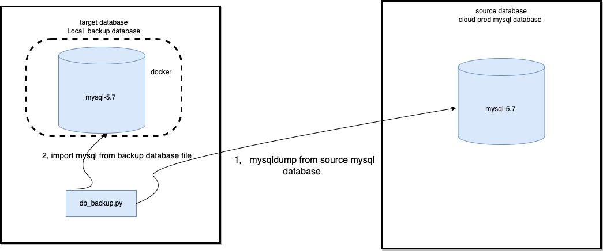

# 1 Architecture 


   It's the lightest  mysql dump and backup tool .  We just need a source docker mysql as the backup database and when we need to backup the whole databases from cloud mysql instance ,just run  the db_backup.py file ans all the databases can be imported into the target docker mysql instance;


  




# 2  How to use it 

## 2.1 git clone 

## 2.2  pip3 install 

​     Because we need the script automaticly backup and import databases , so need the pexpect to avoid inputting password manually. 

```
pip3 install pexpect  
pip3 install argparse
```


## 2.3  edit  config.py 


Assumed that mysql_host is the cloud prod mysql instance  and the dist_host is your local docker mysql database instance.

mysql_databases:  It's all the databases in your mysql instance. You can replace them with your own databases. 

```

{
    "mysql_host": "rm-XXXX.mysql.rds.tencent.com",
    "mysql_port": 3306,
    "mysql_databases": "dian-account,dian-insurance,dian-leaf,dian-mainentry,dian-mini,dian-promote,dian-public,dian-training,dian-xxl-job,dian-xxl-job-client",
    "mysql_user": "root",
    "mysql_password": "123&456",
    "container_name": "mysql-5.7",
    "dist_host": "127.0.0.1",
    "dist_port": 3306,
    "dist_user": "root",
    "dist_password": "Haha&MysqL"
}

```


## 2.4 Start the mysql in dokcer

##  

Run the docker-compose.yaml 

```
docker-compose up -d 
```

To see the docker status 

```
docker ps 
```


## 2.5  Enter the docker mysql and grant privileges


### 2.5.1 Enter the mysql  docker 

```
docker exec -it mysql-5.7  /bin/sh  
```

### 2.5.2  Login the mysql 

```
./bin/mysql -h 127.0.0.1 -u root -p
```


### 2.5.3  Grant the root account of mysql 

```

GRANT ALL ON *.* TO 'root'@'%';

flush privileges;

```

### 2.5.4  Create  all the database need to backup 

Please create the databases that confiured in the config.py file. 

For example: 

```
create database `dian-account`;

create database `dian-insurance`;

create database `dian-leaf`;

create database `dian-mainentry`;

create database `dian-mini`;

create database `dian-promote`;

create database `dian-public`;

create database `dian-training`;

create database `dian-xxl-job`;

create database `dian-xxl-job-client`;
```


## 2.6 Execute the backup script 

Just execute the python script 

```

python3 db_backup.py 

```

After executing the script , all the dabases from the cloud mysql will be back up into the local docker mysql 

Below is the log info .


##    2.7  Files 


   


| files        | Description                                                  | Note |
| ------------ | ------------------------------------------------------------ | ---- |
| 2025-09-12   | backup folder ; It was generated by the script ;             |      |
| config.py    | account and host , port for  source mysql from cloud and target mysql in local docker |      |
| db_backup.py | the backup file written in Python; need python3.x            |      |

 

## License

```
This repository is licensed under the Dify Open Source License, based on Apache 2.0 with additional conditions.

```

# 

# Donation


If it's helpful to you , could you buy me a cup of coffee ? 


  Thank your donation !  Your support will be our  passion to improve ! 

# Questions & Support 


